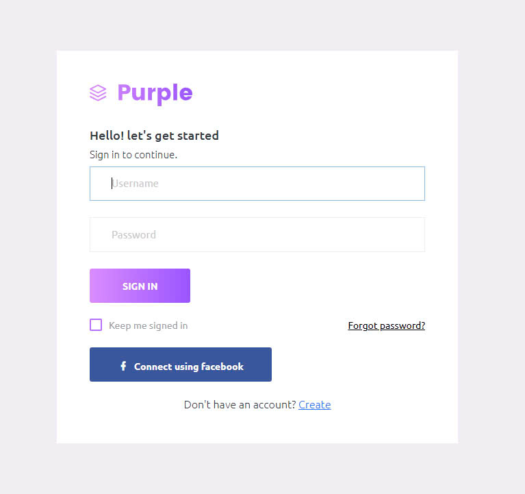
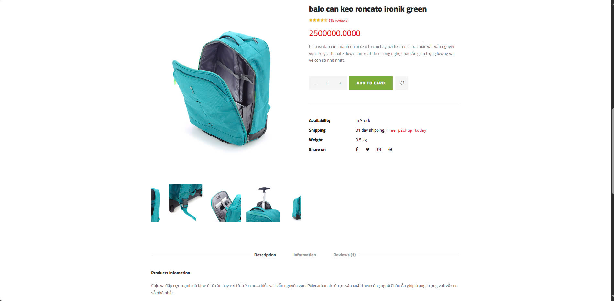

# Luggage E-commerce Website Project

>> An online platform for selling luggage, offering a wide range of products with features to enhance the shopping experience.

## Features

1. User-friendly Interface: Modern and responsive design for seamless navigation.

2. Product Categories: Organize luggage by size, type, and price range.

3. Search & Filter: Advanced search and filtering options for users to find products quickly.

4. Secure Payment: Integration with popular payment gateways for safe transactions.

5. Order Management: Track and manage orders easily through a user dashboard.

6. Mobile Compatibility: Fully optimized for mobile devices.

## Technology Stack

1. Frontend: HTML, CSS, JavaScript 

2. Backend: C#, ASP.NET MVC

3. Database: SQL Server

4. Hosting: IIS

## Installation

Clone the repository:

git clone https://github.com/KimQuang19/luggage-ecommerce.git

## Pictures

## License

This project is licensed under the MIT License.

## Contact

For questions or suggestions, please contact us:

Email: quangh922@gmail.com

